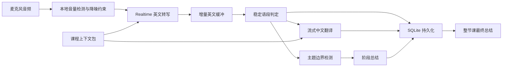

# NUS 实时课堂翻译与总结 App

产品与技术规格 v1.0（需求已冻结）

## 1. 产品目标

为 NUS 线下课堂提供一个 macOS 桌面应用，通过电脑麦克风采集教师声音，实时生成英文转写和简体中文翻译，并在教师讲完一个小主题后自动生成阶段总结。课程结束时生成整节课总结，所有文本结果保存在本机。

首要优化目标是低延迟实时翻译。识别质量、总结质量和成本在不明显损害实时性的前提下优化。

## 2. 冻结需求

### 使用场景

- 平台：macOS 桌面端。
- 环境：NUS 线下教室，电脑内置麦克风为默认音源。
- 主要说话人：教师；学生提问可被记录，但 MVP 不做说话人分离。
- 输入语言：主要为带印度口音的英语，可能夹杂专业术语。
- 输出语言：简体中文。

### 课堂页面

- 右侧显示实时记录，每个稳定语段包含时间戳、英文转写、中文翻译。
- 英文增量结果先出现；中文在语句达到可翻译稳定度后流式出现。
- 左侧按主题展示阶段总结，最新总结自动加入顶部或时间流末端。
- 顶部提供课程选择、课堂名称、麦克风选择、录制状态、时长、暂停与结束按钮。
- 提供“立即总结”按钮，作为自动主题判断的手动兜底。

### 课程上下文

- 每门课可录入课程名和课程简介。
- 可导入 slides、syllabus 和专业词表。
- MVP 支持 PDF、PPTX、TXT/Markdown；DOCX 可作为下一阶段格式。
- 导入资料用于提取术语、缩写、专有名词和主题，不在每次请求中重复上传整份文件。
- 用户可以查看、编辑、启用或禁用自动提取的术语。

### 保存与导出

- 默认保存完整英文转写、中文翻译、阶段总结和最终总结。
- 默认不保存原始音频。
- 支持恢复意外中断的课堂记录。
- MVP 导出 Markdown；后续增加 PDF 和 DOCX。

### 云端与隐私

- 接受将实时音频和必要文本发送给云端模型处理。
- 不建设自有云端业务服务器；应用直接连接模型服务。
- API 密钥保存在 macOS Keychain，不写入配置文件或本地数据库。
- 课堂资料原文件保存在本地；只发送识别或总结所需的精简上下文。

## 3. 不纳入 MVP

- Zoom、Teams 或系统音频采集。
- Windows、iOS、Android 客户端。
- 多人说话人分离和教师声纹识别。
- 多设备同步、账号系统和云端资料库。
- 原始音频长期保存。
- 课堂中自动回答问题或生成语音。

## 4. 体验与验收指标

网络正常、麦克风信噪比可用时：

| 指标 | MVP 目标 |
| --- | --- |
| 英文首个增量文本 | 通常 0.5–1.5 秒 |
| 英文稳定语段 | 通常 1–2.5 秒 |
| 中文翻译 | 在英文稳定短句后 0.8–2 秒，总体通常 1.5–3.5 秒 |
| 阶段总结 | 主题边界确认后 2–6 秒 |
| 连续运行 | 至少 120 分钟，不丢失已确认文本 |
| 断网恢复 | 自动重连；未发送片段给出明确状态 |
| 术语效果 | 导入词表中的重点术语可被识别提示和翻译词表共同使用 |

这些是产品目标，不是模型服务 SLA。实际延迟受网络、座位距离、教室混响和教师音量影响。

## 5. UI 结构

```text
┌──────────────────────────────────────────────────────────────────────┐
│ 课程 ▼   Lecture 05                     ● 录制中  00:42:18  ⏸  ■ │
├──────────────────────────┬───────────────────────────────────────────┤
│ 阶段总结                  │ 实时记录                                  │
│                          │                                           │
│ 10:18  Supply elasticity │ 10:22:14                                  │
│ • 定义与关键条件         │ Elasticity measures how responsive...    │
│ • 教师使用的例子         │ 弹性衡量需求量对价格变化的敏感程度……     │
│ • 易混淆点               │                                           │
│                          │ 10:22:21                                  │
│ 10:07  Demand curves     │ The important exception here is...       │
│ • ……                     │ 这里一个重要的例外是……                   │
│                          │                                           │
├──────────────────────────┴───────────────────────────────────────────┤
│ [Mic] MacBook Microphone  ▂▄▆  连接正常    [立即总结] [添加标记] │
└──────────────────────────────────────────────────────────────────────┘
```

- 左右默认宽度约 38:62，可拖动调整。
- 英文为主文本，中文使用稍弱的视觉层级，但保持足够字号和对比度。
- 增量英文使用较浅颜色；语段确认后转为稳定颜色并触发翻译。
- 网络、麦克风音量过低和重连必须用明确状态提示，不能静默失败。
- 阶段总结包含主题标题、3–6 个要点、例子/公式、考试或作业提示。

## 6. 技术架构

### 技术栈

| 层 | 选择 | 作用 |
| --- | --- | --- |
| 桌面壳 | Tauri 2 | macOS 打包、系统权限、Keychain、文件访问 |
| UI | React + TypeScript | 双栏课堂界面、课程管理、实时状态 |
| 本地核心 | Rust | 安全凭证、会话创建、文件处理、持久化命令 |
| 本地数据 | SQLite | 课程、术语、课堂、语段和总结 |
| 实时识别 | OpenAI Realtime transcription | 麦克风音频到英文增量转写 |
| 翻译与总结 | OpenAI Responses API，模型可配置 | 流式英中翻译、主题判断和总结 |

不把模型名称散落在业务代码中。识别、翻译、主题判断和总结分别使用配置项，以便模型可用性或价格变化时替换。

### 推荐连接方式

1. UI 向 Tauri 本地核心请求创建短期实时会话。
2. 本地核心从 Keychain 读取 API 密钥并创建临时凭证。
3. UI 通过 WebRTC 将麦克风音频直接发送到实时转写服务。
4. 本地核心从不把长期 API 密钥暴露给 WebView。
5. 翻译、主题判断和总结请求由本地核心代理，结果以事件流返回 UI。

WebRTC 适合浏览器式麦克风采集和低延迟传输。若 Tauri WebView 在目标 macOS 版本上存在兼容问题，备用路径是在 Rust 中采集 PCM 音频并通过 WebSocket 发送。

## 7. 数据流



### 实时语段状态

每个语段依次经历：

`receiving → interim → finalized → translating → complete`

- `interim` 只更新英文，不写入最终记录。
- `finalized` 写入英文，并触发翻译。
- 翻译按稳定短句执行，不对每个 token 单独发请求。
- 任何修订都使用语段 ID 更新原记录，避免产生重复文本。
- 每 1–2 秒或每次语段完成后执行事务写入，减少崩溃损失。

## 8. 课程上下文包

导入资料后在本地执行：

1. 提取 PDF/PPTX/TXT 文本。
2. 去除页眉、页脚和重复内容。
3. 提取课程描述、缩写、英文术语、标准中文译法及所在章节。
4. 用户确认或修改词表。
5. 生成三种运行时上下文：
   - 识别提示：课程场景说明和高优先级英文关键词。
   - 翻译词表：英文术语到首选中文译法。
   - 总结背景：课程主题、当前 lecture 资料和已有阶段总结。

实时识别只携带短提示和高优先级关键词。翻译与总结根据当前语段检索相关术语，避免把全部 slides 反复发送，降低延迟和成本。

## 9. 自动主题总结

不能只依赖固定的五分钟计时器。MVP 使用混合判定：

1. 每 30 秒检查一次最近新增的已确认文本。
2. 识别教师的转场表达，例如 “now let’s move on”、回顾句、结论句和新标题。
3. 比较新内容与当前主题的语义一致性，并结合较长停顿。
4. 连续两次判断为新主题后，关闭旧主题并生成总结。
5. 时间护栏：主题至少 2 分钟，通常 4–8 分钟，超过 10 分钟强制检查并允许切分。
6. “立即总结”可随时关闭当前主题；用户后续可合并或重新生成总结。

阶段总结以结构化数据保存：

- 主题标题
- 起止时间
- 核心概念
- 教师给出的例子或类比
- 公式、定义和限制条件
- 作业、考试或阅读提示
- 仍不清楚的问题

## 10. 最终总结

结束录制后，以阶段总结为骨架、完整转写为证据生成：

- 本节课概览
- 按主题组织的知识点
- 关键定义、公式和例子
- 教师强调或重复的内容
- 作业、考试、截止日期和阅读要求
- 易混淆点
- 5–10 个复习问题

最终总结必须引用时间戳范围，方便回到原转写核对。若生成失败，课堂记录仍保持完整，并可稍后重试。

## 11. 本地数据模型

| 表 | 关键字段 |
| --- | --- |
| `courses` | id, code, name, description, created_at |
| `course_documents` | id, course_id, path, type, hash, parse_status |
| `glossary_terms` | id, course_id, english, chinese, aliases, priority, enabled |
| `lectures` | id, course_id, title, started_at, ended_at, status |
| `transcript_segments` | id, lecture_id, seq, start_ms, end_ms, english, chinese, status |
| `topic_summaries` | id, lecture_id, start_ms, end_ms, title, content_json |
| `lecture_summaries` | lecture_id, content_json, model, generated_at |

数据库保存在应用专属目录。MVP 使用系统文件权限保护；后续可增加数据库加密。

## 12. 延迟策略

- 实时识别使用低延迟配置并只指定英语输入。
- 将课程术语作为识别关键词，而不是发送长篇 slide 原文。
- 先显示英文增量文本，不等待中文。
- 中文按稳定短句翻译，使用流式响应。
- 翻译请求保持极短上下文：当前短句、前一短句和相关词表。
- 主题判断与总结在独立任务队列执行，不能阻塞转写与翻译。
- UI 更新做批量刷新，避免每个字符触发完整列表渲染。
- 断网时保留本地状态，指数退避重连，并明确标记缺失区间。

## 13. 成本方案

官方模型目录中，`gpt-realtime-whisper` 当前按音频时长计价，为 0.017 美元/分钟，即约 1.02 美元/小时、2.04 美元/两小时。实时转写指南当前还推荐 `gpt-live-transcribe`；实施时应按账号可用性做一次延迟、准确率和实际账单对比，不把模型写死。

翻译与总结使用小型文本模型，并减少重复上下文。以一节两小时课堂估算：

- 英文实时转写：约 2.04 美元（按上述公开单价）。
- 翻译、主题判断、阶段和最终总结：通常约 0.20–0.60 美元，取决于课堂语速、模型和重复上下文。
- 合计规划值：约 2.25–2.65 美元/两小时课堂。

这是工程预算，不是固定报价。应用应显示本节课的预计用量，并允许设置每日或每月预算提醒。

不建议 MVP 同时运行独立实时语音翻译模型和英文转写模型，因为会重复发送音频并显著增加成本；英文转写后进行流式文本翻译更符合当前需求。

## 14. 隐私与安全

- OpenAI API 数据默认不用于训练模型，除非账户主动选择共享。
- API 默认可能生成滥用监控日志，官方文档说明通常最多保留 30 天；不要在 UI 中声称“零留存”。
- 原始音频默认不落盘。
- 长期 API 密钥只存 Keychain；前端只获得短期会话凭证。
- 课程原文件和完整课堂数据库留在本机。
- 提供按课堂删除、按课程删除和全部清除功能。
- 导出文件由用户明确触发，不自动同步到第三方云盘。
- 首次录制前提示用户遵守学校、课程和所在地区关于课堂录音与转写的规定。

## 15. MVP 里程碑

### M0：实时链路验证（2–3 天）

- macOS 麦克风授权和音量检测。
- 英文增量转写。
- 稳定短句的流式中文翻译。
- 用真实印度口音讲课片段验证延迟和术语错误类型。

验收：连续运行 30 分钟；英文和中文延迟达到目标区间；无重复语段。

### M1：可用课堂界面（4–5 天）

- 双栏 UI、暂停、结束、立即总结和状态提示。
- SQLite 自动保存和崩溃恢复。
- 课程创建、课程切换、手动词表。

验收：连续运行 120 分钟；应用重启后可恢复已完成记录。

### M2：课程资料与主题总结（5–7 天）

- PDF/PPTX/TXT 导入与术语提取。
- 识别关键词和翻译词表注入。
- 自动主题边界检测、阶段总结和手动兜底。

验收：重点术语改善可观察；一节真实课堂的主题切分基本合理，误切分可手动修正。

### M3：课程结束与交付（3–4 天）

- 整节课总结、时间戳引用和 Markdown 导出。
- 网络重连、失败重试、预算估算和删除功能。
- 应用打包、权限说明和课堂实测清单。

验收：从课程创建到两小时录制、最终总结和导出可完整走通。

整体 MVP 预计 3–4 周，包括 NUS 真实教室中的迭代时间。

## 16. 开发顺序与关键风险

开发从 M0 开始，不先做完整资料管理。低延迟链路是最大技术风险，必须先用真实教室条件验证。

主要风险及处理：

| 风险 | 处理 |
| --- | --- |
| 教师距离远、混响强 | 音量/信噪比提示；建议靠前座位；后续支持外接指向麦克风 |
| 印度口音与术语叠加 | 英语限定、课程关键词、词表、真实课程样本回归测试 |
| 增量转写反复修订 | interim/finalized 状态机；只翻译稳定短句 |
| 自动主题切分过碎 | 最短时间、连续确认、手动合并和立即总结 |
| 网络中断 | 本地事务保存、自动重连、缺失区间提示 |
| 模型名称或价格变化 | 模型配置层、启动时能力检查、成本估算独立配置 |
| API 密钥泄漏 | Keychain + 临时会话凭证；不进入前端日志和数据库 |

## 17. 开工前最后检查

以下假设随 v1 一并冻结：

- 首版只支持 macOS。
- 中文为简体中文。
- 默认不保存原始音频。
- 默认单一教师场景，不做说话人标注。
- 用户自行提供 OpenAI API 密钥并承担 API 费用。
- 课程资料以英文为主，导入后允许人工修正术语。

若这些假设不变，下一步直接进入 M0 原型实现。

## 18. 官方参考

- [OpenAI Realtime transcription guide](https://developers.openai.com/api/docs/guides/realtime-transcription)
- [GPT-Realtime-Whisper model and pricing](https://developers.openai.com/api/docs/models/gpt-realtime-whisper)
- [OpenAI API data controls](https://developers.openai.com/api/docs/guides/your-data)
